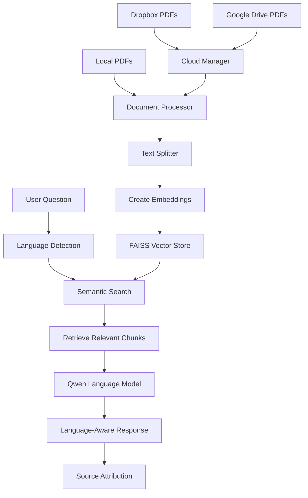

# 🔍 PDF Q&A Assistant with Cloud Storage

[](https://www.python.org/downloads/)
[](https://gradio.app/)
[](https://opensource.org/licenses/MIT)
[](https://huggingface.co/transformers/)

A comprehensive PDF Question-Answering system that combines **Retrieval-Augmented Generation (RAG)** with **Qwen language models**, **cloud storage integration**, and **multilingual support**. Upload PDFs from local storage, Google Drive, or Dropbox, and ask intelligent questions with context-aware, accurate answers.

## ✨ Key Features

### 🤖 **Advanced Language Models**
- **Dual Model Support**: Choose between `Qwen/Qwen3-1.7B` and `Qwen/Qwen3-4B`
- **Intelligent GPU Management**: Automatic model switching with memory optimization
- **See Memory Usage**: Track GPU usage and prevent OOM errors

### ☁️ **Cloud Storage Integration**
- **Dropbox Integration**: Connect with access token, browse folders, select PDFs
- **Google Drive Integration**: OAuth2 and Service Account support
- **Seamless File Management**: List, select, and process files directly from cloud storage

### 🌐 **Multilingual Support**
- **15+ Languages**: English, Hindi, Spanish, French, German, Portuguese, Russian, Japanese, Korean, Arabic, Chinese, Italian, Dutch, Turkish
- **Hinglish Detection**: Smart detection and handling of Hindi-English mixed text
- **Language-Aware Responses**: Automatically respond in the same language as the question
- **Optimized Embeddings**: Different embedding models for English-only vs multilingual mode

### 🔍 **Retrieval-Augmented Generation (RAG)**
- **Semantic Search**: FAISS vector database with sentence-transformers embeddings
- **Smart Document Chunking**: Configurable text splitting with overlap control
- **Context-Aware Responses**: Only relevant document sections sent to the model
- **Source Attribution**: Track which document and page generated each answer

### 💬 **General Purpose Chat**
- **Standalone AI Chat**: Use the loaded model for general questions without documents
- **Flexible Interface**: Separate tab for non-document-based conversations
- **Same Model, Multiple Uses**: Switch between document Q&A and general chat

### 🎨 **Professional User Interface**
- **Tabbed Interface**: Organized workflow with Setup, Cloud Storage, Documents, General Chat, and Q&A tabs
- **Real-time Status Updates**: Detailed feedback for every operation
- **Advanced Settings**: Configurable parameters with helpful tooltips
- **Responsive Design**: Clean, intuitive design with proper spacing and styling

## 🏗️ Architecture Overview



## 📦 Installation

### Prerequisites
- Python 3.12
- CUDA 12.8 (for GPU acceleration)
- At least 4GB free disk space for models
- Internet connection for cloud storage features

### 1. Clone the Repository
```bash
git clone https://github.com/jaysheeldodia/QwInSight.git
cd QwInSight
```

### 2. Create Virtual Environment
```bash
python -m venv venv

# On Windows
venv\Scripts\activate

# On macOS/Linux
source venv/bin/activate
```

### 3. Install Dependencies
```bash
pip install -r requirements.txt
```

### 4. Optional: Install Cloud Storage Dependencies
```bash
# For Dropbox integration
pip install dropbox

# For Google Drive integration
pip install google-api-python-client google-auth-httplib2 google-auth-oauthlib

# For multilingual support
pip install langdetect
```

## 🚀 Quick Start

### 1. Launch the Application
```bash
python app.py
```

### 2. Access the Interface
Open your browser and navigate to:
```
http://localhost:7860
```

### 3. Complete Setup Workflow

#### Step 1: Initial Setup
1. **Choose Language Mode**:
   - **English Only**: Faster processing, optimized for English documents
   - **Multilingual**: Supports 15+ languages with automatic detection

2. **Select AI Model**:
   - **Qwen/Qwen3-1.7B**: Faster, requires ~3.5GB GPU memory
   - **Qwen/Qwen3-4B**: More capable, requires ~8GB GPU memory

3. **Load Model**: Click "🔄 Load Model" and wait for completion

#### Step 2: Cloud Storage Setup (Optional)

##### Dropbox Integration
1. Go to [Dropbox App Console](https://www.dropbox.com/developers/apps)
2. Create a new app with "Full Dropbox" access
3. Generate an access token
4. Enter token in the Cloud Storage tab
5. Connect and list your PDF files

##### Google Drive Integration
**Option A: Service Account (Recommended)**
1. Create a Google Cloud project
2. Enable Google Drive API
3. Create Service Account credentials
4. Download JSON key file
5. Share your Drive folder with the service account email
6. Upload credentials and connect

**Option B: OAuth2 (Not Recommended)**
1. Create OAuth2 credentials in Google Cloud Console
2. Add `urn:ietf:wg:oauth:2.0:oob` as redirect URI
3. Upload credentials JSON
4. Complete authorization flow with the provided link

#### Step 3: Process Documents

##### Local Upload
1. Go to Documents → Local Upload tab
2. Upload one or more PDF files
3. Configure processing parameters:
   - **Chunk Size**: 200-1000 characters (default: 500)
   - **Chunk Overlap**: 0-200 characters (default: 50)
4. Click "🔄 Process Local Documents"

##### Cloud Files
1. Go to Documents → Cloud Files tab
2. Files from connected cloud storage will appear
3. Select desired files using checkboxes
4. Use "Select All" or "Deselect All" for convenience
5. Click "🔄 Process Selected Cloud Files"

#### Step 4: Ask Questions
1. Go to the "💬 Ask Questions" tab
2. Enter your question about the processed documents
3. Adjust response settings:
   - **Response Length**: 100-800 tokens
   - **Creativity**: 0.1-1.0 temperature
   - **Context Sources**: 1-8 relevant chunks
4. Click "🤔 Ask Question"

#### Step 5: General Purpose Chat
1. Go to the "🌐 General Purpose Chat" tab
2. Ask any general question (not document-specific)
3. Adjust response settings as needed
4. Click "💬 Ask"

## ⚙️ Configuration Options

### Language Modes
| Mode | Speed | Languages | Embedding Model | Best For |
|------|-------|-----------|-----------------|----------|
| English Only | ⚡⚡⚡ | English | all-MiniLM-L6-v2 | English documents |
| Multilingual | ⚡⚡ | 15+ languages | paraphrase-multilingual-MiniLM-L12-v2 | Mixed language documents |

### Model Comparison
| Model | Parameters | Speed | Quality | GPU Memory | Best For |
|-------|------------|-------|---------|------------|----------|
| Qwen/Qwen3-1.7B | 1.7B | ⚡⚡⚡ | ⭐⭐⭐ | ~3.5GB | Quick answers, limited resources |
| Qwen/Qwen3-4B | 4B | ⚡⚡ | ⭐⭐⭐⭐ | ~8GB | Complex analysis, detailed responses |

### Document Processing Parameters

#### Chunk Size Guidelines
- **200-400**: Best for specific details, technical documents
- **400-600**: Balanced approach (recommended for most documents)
- **600-1000**: Better for narrative documents, broader context

#### Chunk Overlap Guidelines
- **0-25**: Minimal overlap, faster processing
- **25-75**: Balanced approach (recommended)
- **75-200**: Maximum context preservation, slower processing

## 🌍 Multilingual Capabilities

### Supported Languages
- **English**: Native support with optimized embeddings
- **Hindi**: Full Devanagari script support
- **Hinglish**: Smart detection of Hindi-English mixed text
- **European**: Spanish, French, German, Italian, Dutch, Portuguese, Russian
- **Asian**: Japanese, Korean, Chinese, Arabic, Turkish

### Language Detection Features
- **Automatic Detection**: Uses langdetect library for accurate language identification
- **Hinglish Recognition**: Custom patterns to detect Hindi-English mixed content
- **Response Matching**: Automatically responds in the same language as the question
- **Script Support**: Handles both Roman and native scripts

### Language-Specific Instructions
The system provides appropriate instructions to the AI model based on detected language:
- Hindi questions → Hindi responses (in Devanagari)
- Hinglish questions → Hinglish responses (Roman script)
- Spanish questions → Spanish responses
- And so on for all supported languages

## 🔧 Cloud Storage Features

### Dropbox Integration
- **Simple Setup**: Just need access token
- **Folder Navigation**: Browse specific folders or root directory
- **File Information**: Shows file size, modification date
- **Batch Processing**: Select multiple files for processing

### Google Drive Integration
- **Flexible Authentication**: Both OAuth2 and Service Account support
- **Folder Filtering**: Process files from specific folders
- **Metadata Access**: File size, modification date, full file information
- **Secure Connection**: Uses official Google APIs

### File Management
- **Temporary Downloads**: Files downloaded to temporary directory
- **Automatic Cleanup**: Temporary files cleaned after processing
- **Source Attribution**: Answers show which cloud service files came from
- **Error Handling**: Comprehensive error messages for connection issues

## 📊 Performance Benchmarks

### Processing Performance
| Document Source | Setup Time | Processing Speed | Memory Usage |
|----------------|------------|------------------|--------------|
| Local Upload | Instant | 15-30 sec/doc | 2-4GB RAM |
| Dropbox | 2-5 sec | 20-35 sec/doc | 2-4GB RAM |
| Google Drive | 3-10 sec | 25-40 sec/doc | 2-4GB RAM |

### Language Performance
| Language | Performance | Response Quality | Processing Speed |
|----------|-------------------|------------------|------------------|
| English | 99% | ⭐⭐⭐⭐⭐ | Fastest |
| Others | 90% | ⭐⭐⭐⭐ | Medium |

### System Requirements

- **CPU**: 8+ cores, 3.0+ GHz
- **RAM**: 16GB+
- **Storage**: 20GB+ free space
- **GPU**: NVIDIA with 10GB+ VRAM
- **Internet**: Stable broadband connection

## 🔐 Security & Privacy

### Data Handling
- **Local Processing**: All AI processing happens locally on your machine
- **Temporary Storage**: Cloud files temporarily downloaded, then deleted
- **No Data Transmission**: Your documents and questions never leave your computer
- **Secure APIs**: Uses official cloud storage APIs with proper authentication

### Credentials Management
- **Token Storage**: Access tokens stored in memory only (not saved to disk)
- **Automatic Cleanup**: Credentials cleared when application closes
- **Best Practices**: Follow cloud provider security guidelines

## 📈 Advanced Usage

### Custom Deployment

#### Docker Deployment
```dockerfile
FROM python:3.12-slim

# Install system dependencies
RUN apt-get update && apt-get install -y \
    gcc \
    g++ \
    && rm -rf /var/lib/apt/lists/*

WORKDIR /app

# Copy requirements and install Python dependencies
COPY requirements.txt .
RUN pip install --no-cache-dir -r requirements.txt

# Install optional dependencies
RUN pip install dropbox google-api-python-client google-auth-httplib2 google-auth-oauthlib langdetect

# Copy application
COPY . .

EXPOSE 7860

CMD ["python", "app.py"]
```

#### Production Deployment
```bash
# Install production server
pip install gunicorn

# Run with multiple workers (adjust based on your system)
gunicorn -w 1 -b 0.0.0.0:7860 --timeout 300 --worker-class uvicorn.workers.UvicornWorker app:app

# Or use the built-in Gradio server for production
python app.py
```

## 🤝 Contributing

We welcome contributions! Please see our [Contributing Guidelines](CONTRIBUTING.md) for details.

### Development Setup
```bash
git clone https://github.com/jaysheeldodia/QwInSight.git
cd QwInSight
python -m venv dev-env
source dev-env/bin/activate  # or dev-env\Scripts\activate on Windows
pip install -r requirements.txt
```

## 📄 License

This project is licensed under the MIT License - see the [LICENSE](LICENSE) file for details.

## 🙏 Acknowledgments

- **Hugging Face**: For the Transformers library and model hosting
- **LangChain**: For the RAG framework and document processing tools
- **Gradio**: For the intuitive web interface framework
- **FAISS**: For efficient similarity search and vector operations
- **Google**: For Drive API and authentication libraries
- **Dropbox**: For cloud storage API and SDK


---

**⭐ Star this repository if you find it helpful!**